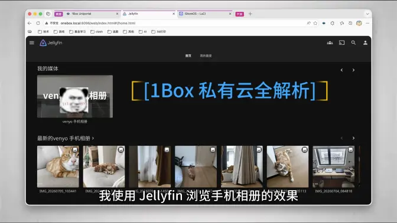
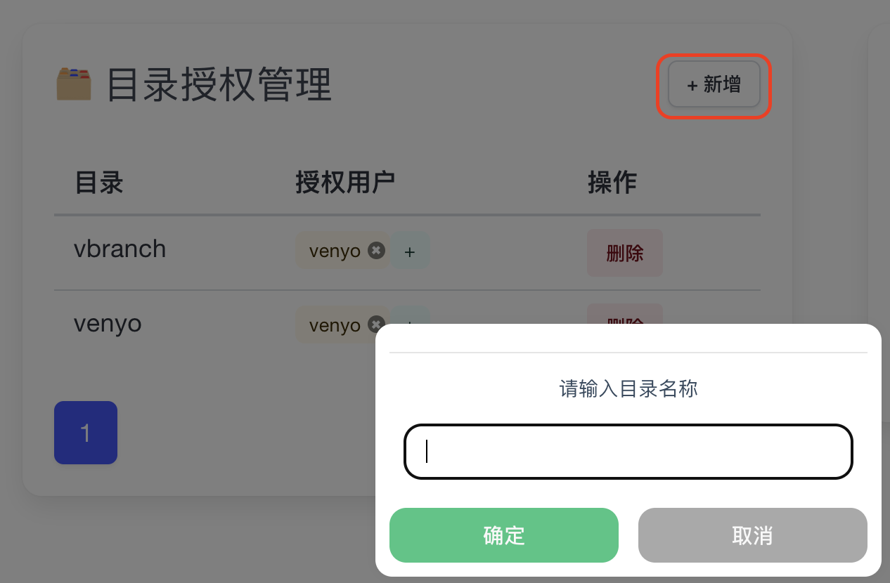
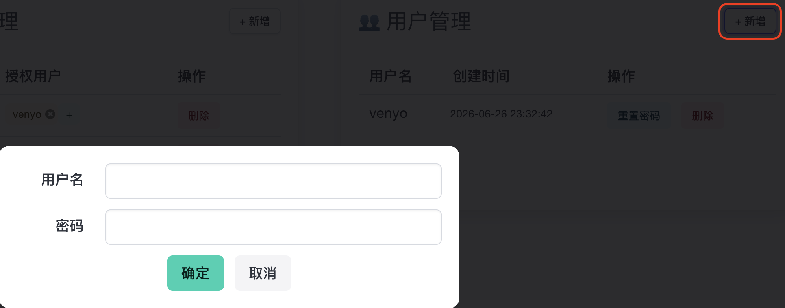
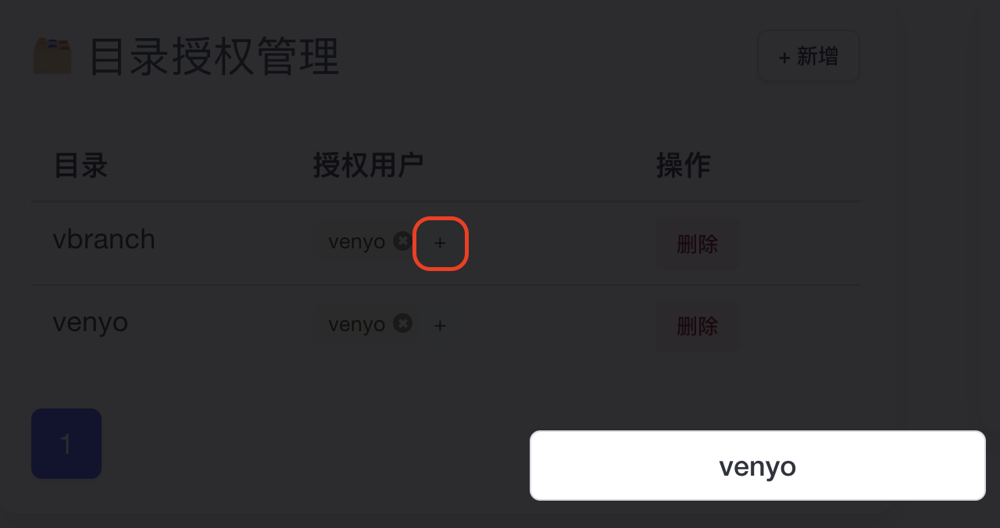
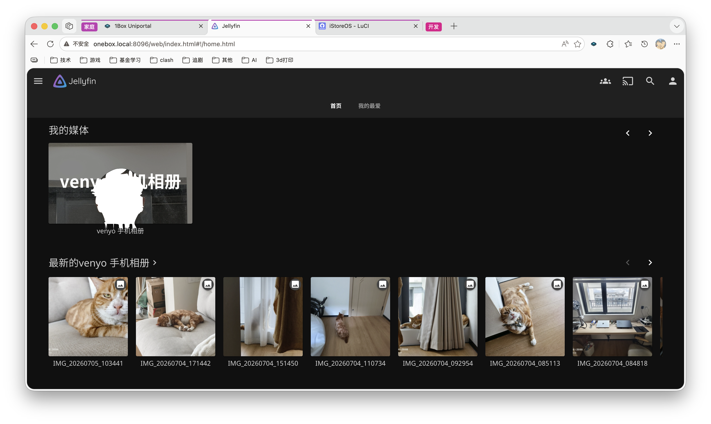

私有云
=====

视频介绍
-------

<a href="https://www.bilibili.com/video/BV1tzMh6xEq3" target="_blank" rel="noopener noreferrer">
  
  

    ▶ 点击图片跳转B站观看完整功能介绍
  

</a>

创建云目录
--------

添加用户
------

用户授权
-------

pc 通过 smb 协议连接 1Box
------------------------

关于不同操作系统的 pc 如何通过 smb 协议连接网络文件服务器，网上有大量的教程，开头的视频里面也有演示，在此不多赘述

使用 1Box + Joplin 实现私有云笔记功能
----------------------------------

私有云笔记功能的使用场景应该不太可能只局限于家里，所以需要先从配置内网穿透开始，请参考 [EasyTier](advanced.md) 先完成异地组网的配置

下载完 Joplin 之后，按照以下截图进行配置

1. 同步目标选择 WebDAV
2. URL 按照 `{域名}/cloud/dav/{目录}` 的格式进行填写，域名是 EasyTier 自动为 1Box 设备分配的 IP，目录就是您刚刚创建的云目录
3. 用户名/密码就是您授权给该云目录的用户的账号密码

若有疑问或遇到问题，可以参考上面的视频，或者网上搜索一下教程，但是 URL 必须按照以上说明的进行配置

手机文件同步
----------

关于手机文件同步，开发者调研了许多方案和 APP，最后觉得 FolderSync 是免费应用中使用最方便快捷的方案了，唯一麻烦的点就是需要自己手动找到需要同步的目录

推荐使用 SMB 协议进行同步

至于视频中提到的，使用 Jellyfin 展示图片，请参考 [媒体库](flixhub.md) 功能

