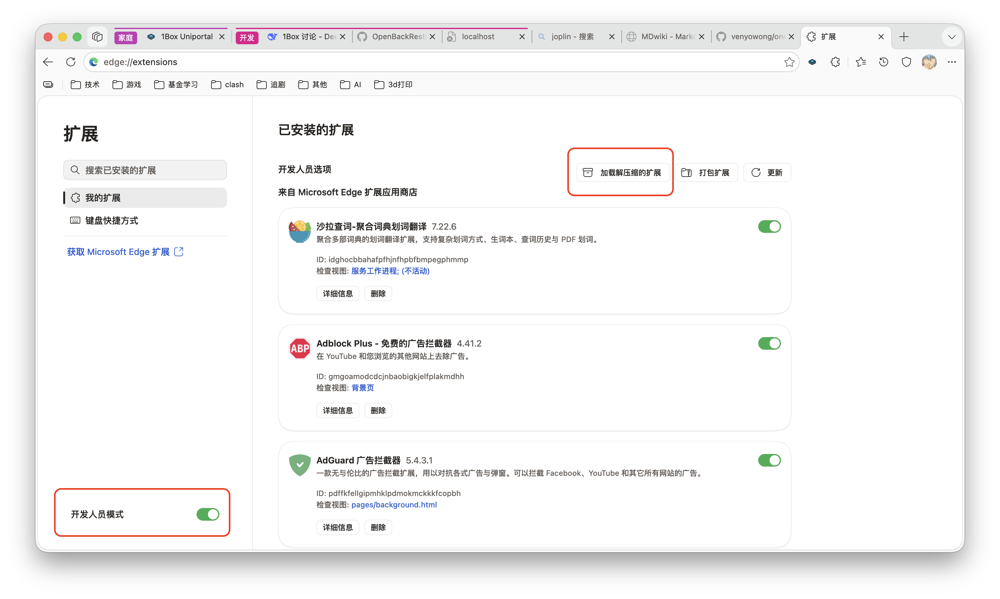
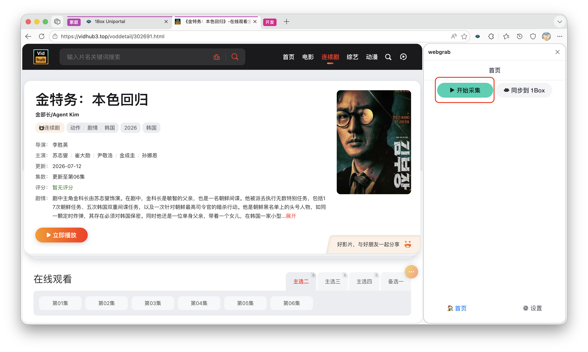
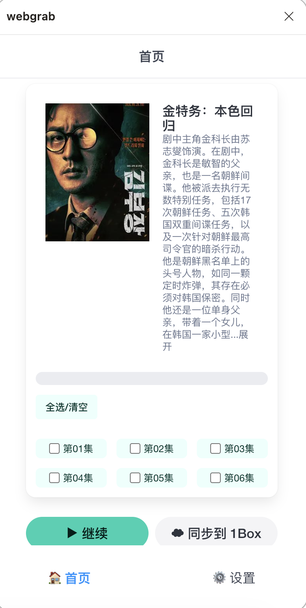
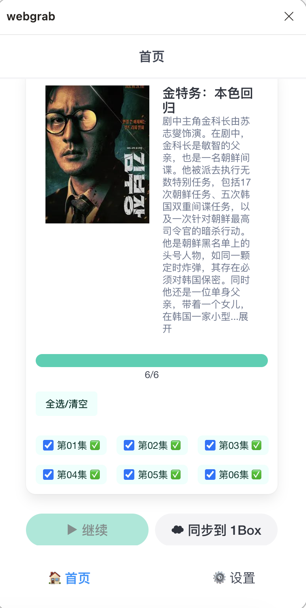
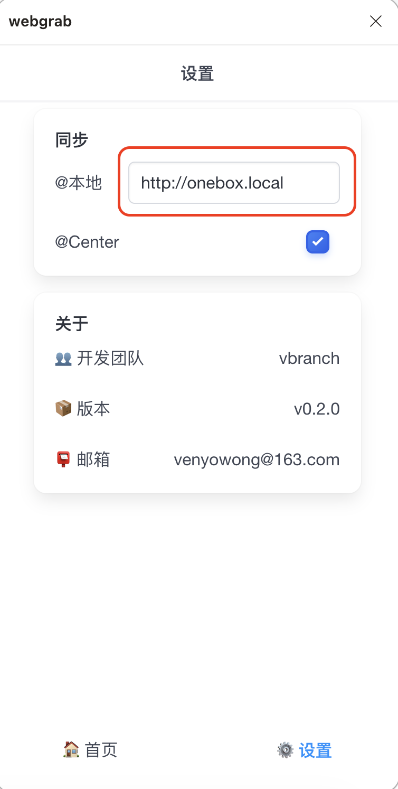
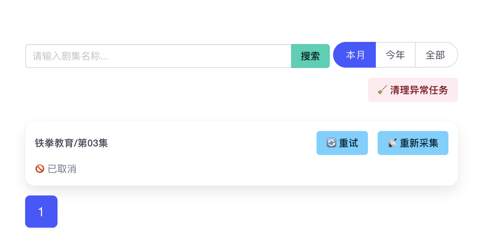

媒体库
=======

免责声明
------

> 1. **开发目的**：1Box 的媒体库功能旨在帮助用户整理和播放其**已有权访问的媒体文件**。为方便用户将网页上的相关视频资源快速导入媒体库，我们开发了配套的浏览器插件。该插件仅采集当前网页已加载的视频流链接，不主动爬取、不推荐任何资源，不破解任何网站的版权保护机制。
> 
> 2. **工作原理**：插件仅捕获浏览器当前页面已加载的视频流链接，不主动向任何网站发起请求，不绕过任何网站的访问限制。
> 
> 3. **用户责任**：请确保您采集的视频内容已获得合法的播放及下载授权。1Box 不审查用户采集的内容，若因采集未经授权的内容引发争议，由使用者自行承担全部责任，与 1Box 无关。
> 
> 4. **投诉渠道**：如权利人认为相关内容被不当使用，请联系 [venyowong@163.com](mailto:venyowong@163.com)，我将在收到通知后 3 个工作日内处理。

安装浏览器插件
-----------

1. 插件目前只支持 chrome 内核的浏览器，请您先安装好浏览器
2. 点击 [webgrab.zip](../webgrab.zip) 下载浏览器插件
3. 将压缩包解压到自己熟悉的路径
4. 使用浏览器打开 [edge://extensions/](edge://extensions/)
5. 打开开发者模式，然后点击加载解压缩的扩展，选择刚刚的解压目录
   
6. 然后在最下方就可以看到加载成功的插件了

**#flag：** 为了方便用户使用，后续插件会支持 firefox 以及手机浏览器！

使用插件一键采集资源
----------------

由于视频网站的网页结构各不相同，插件无法做到所有网站都可以解析，所以如果插件在您常用的视频网站无法正常工作，请反馈到 [venyowong@163.com](mailto:venyowong@163.com)，**#flag：**开发者在精力足够的前提下，会开发、兼容尽可能多的网站！

1. 重新打开需要采集的页面，安装完插件后一定要重新打开网页，否则插件无法生效
2. 建议在剧集的详情页进行采集，而不是播放页面
   
3. 点击开始采集
4. 如果插件能够解析当前网页，您将看到以下画面
   
5. 勾选你想要采集的分集，然后点击继续，插件将会自动跳转页面，并监听当前页面所加载的视频链接。插件工作时，可以切换到其他程序，但请勿切换标签页！
6. 如果采集不顺利，请反馈到 [venyowong@163.com](mailto:venyowong@163.com)。如果采集顺利，您将看到以下画面
   
7. 点击同步到 1Box
8. 等待提示同步成功，访问 [onebox.local](http://onebox.local/)，就可以看到采集到的剧集了

**注：** 为了降低插件的使用门槛，本地 1Box 的默认 IP 使用的是 `onebox.local`，但是如果您遇到浏览器不支持 mDNS 导致无法同步的情况，您可以手动将 `onebox.local` 修改为具体 IP

下载
----

下载视频失败时，请尝试以下几种方法：

- 视频资源可能需要科学上网才可下载，请参考 [配置 OpenClash](advanced.md)，配置完后重新尝试下载
- 有些视频资源恰恰相反，只允许国内网络访问，科学上网时下载，会返回 404。因此如果科学上网时下载失败了，可以关闭后重新尝试下载
- 如果采集到的视频链接有很长的一串参数，这种链接可能具有实效性，过了一段时间再去下载，就会直接返回失败。遇到这种情况，可以尝试重新采集后再下载
  

