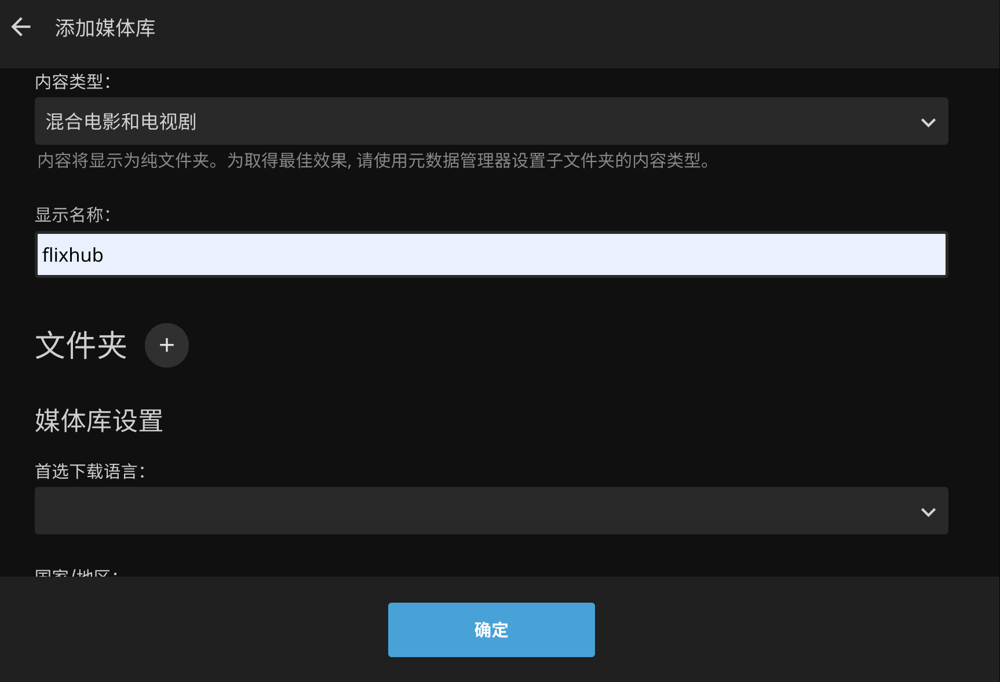
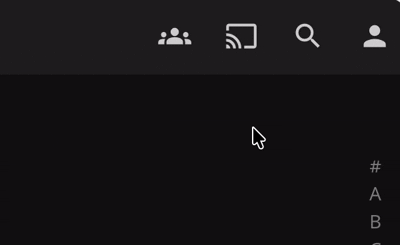

媒体库
=======

免责声明
------

> 1. **开发目的**：1Box 的媒体库功能旨在帮助用户整理和播放其**已有权访问的媒体文件**。为方便用户将网页上的相关视频资源快速导入媒体库，我们开发了配套的浏览器插件。该插件仅采集当前网页已加载的视频流链接，不主动爬取、不推荐任何资源，不破解任何网站的版权保护机制。
> 
> 2. **工作原理**：插件仅捕获浏览器当前页面已加载的视频流链接，不主动向任何网站发起请求，不绕过任何网站的访问限制。
> 
> 3. **用户责任**：请确保您采集的视频内容已获得合法的播放及下载授权。1Box 不审查用户采集的内容，若因采集未经授权的内容引发争议，由使用者自行承担全部责任，与 1Box 无关。
> 
> 4. **投诉渠道**：如权利人认为相关内容被不当使用，请联系 [venyowong@163.com](mailto:venyowong@163.com)，我将在收到通知后 3 个工作日内处理。

安装浏览器插件
-----------

1. 插件目前只支持 chrome 内核的浏览器，请您先安装好浏览器
2. 点击 [webgrab.zip](../webgrab.zip) 下载浏览器插件
3. 将压缩包解压到自己熟悉的路径
4. 使用浏览器打开 [edge://extensions/](edge://extensions/)
5. 打开开发者模式，然后点击加载解压缩的扩展，选择刚刚的解压目录
   
6. 然后在最下方就可以看到加载成功的插件了

**#flag：** 为了方便用户使用，后续插件会支持 firefox 以及手机浏览器！

使用插件一键采集资源
----------------

由于视频网站的网页结构各不相同，插件无法做到所有网站都可以解析，所以如果插件在您常用的视频网站无法正常工作，请反馈到 [venyowong@163.com](mailto:venyowong@163.com)，**#flag：**开发者在精力足够的前提下，会开发、兼容尽可能多的网站！

1. 重新打开需要采集的页面，安装完插件后一定要重新打开网页，否则插件无法生效
2. 建议在剧集的详情页进行采集，而不是播放页面
   
3. 点击开始采集
4. 如果插件能够解析当前网页，您将看到以下画面
   
5. 勾选你想要采集的分集，然后点击继续，插件将会自动跳转页面，并监听当前页面所加载的视频链接。插件工作时，可以切换到其他程序，但请勿切换标签页！
6. 如果采集不顺利，请反馈到 [venyowong@163.com](mailto:venyowong@163.com)。如果采集顺利，您将看到以下画面
   
7. 点击同步到 1Box
8. 等待提示同步成功，访问 [onebox.local](http://onebox.local/)，就可以看到采集到的剧集了

**注：** 为了降低插件的使用门槛，本地 1Box 的默认 IP 使用的是 `onebox.local`，但是如果您遇到浏览器不支持 mDNS 导致无法同步的情况，您可以手动将 `onebox.local` 修改为具体 IP

下载
----

下载视频失败时，请尝试以下几种方法：

- 视频资源可能需要科学上网才可下载，请参考 [配置 OpenClash](advanced.md)，配置完后重新尝试下载
- 有些视频资源恰恰相反，只允许国内网络访问，科学上网时下载，会返回 404。因此如果科学上网时下载失败了，可以关闭后重新尝试下载
- 如果采集到的视频链接有很长的一串参数，这种链接可能具有实效性，过了一段时间再去下载，就会直接返回失败。遇到这种情况，可以尝试重新采集后再下载
  

使用 Jellyfin 接管视频资源
-----------------------

1Box 负责采集信息、下载视频，并将数据同步给 Jellyfin，让 Jellyfin 负责后续播放的职责。1Box 没有启用 Jellyfin 的刮削功能，主要是有以下两点考虑：

1. Jellyfin 更擅长国外资源的刮削，要想能 Jellyfin 的刮削功能满足国内需求，需要安装插件、配置 api key、以及科学上网等，说来惭愧，开发者自身也没有配置成功，曾经还一顿舍弃了 Jellyfin，后面发现 Jellyfin 可以用来承接播放需求，才又启用
2. 假设 Jellyfin 刮削功能可用性高，但是这些元数据也无法直接给 1Box 使用，1Box 还是需要有自己的刮削功能。所以从最小化职责、最大化性能的角度出发，我选择的技术方案是 1Box 刮削后再把数据同步给 Jellyfin，而且 Rust 性能也比 .Net 强，刮削效率更高，而且可控，因为 1Box 的刮削代码是自己实现的

首先，需要在 Jellyfin 中添加一个媒体库：

1. 初次打开 [Jellyfin 页面](http://onebox.local:8096/) 应该会进入一个配置流程，如果打开后是一个选择服务器的页面，则表示 Jellyfin 还未初始化完毕，请再稍等片刻
2. 快进到"添加媒体库"
   - 内容类型：混合电影和电视剧
   - 显示名称：自定义
   - 文件夹：/media/flixhub(这边其实就是对应于 /cloud/flixhub)
   - 启用实时监控：✅
   - 自动加入合集：✅
   - 后面出现的 **TheMovieDb**、**The Open Movie Database** 全部反选(这样 Jellyfin 就不会自动刮削了)
   - 媒体资料储存方式：Nfo
   - 将媒体图像保存到媒体所在文件夹：✅
   
3. 等待 Jellyfin 扫描完毕，您将看到以下类似页面
   
4. 点击右上角第二个按钮，选择播放设备
   
5. 然后就可以享受影视剧集了

1Box 在观影体验上并不是很好，受限于 1Box 的定位：低成本，因此安装的 Jellyfin 镜像是针对低性能开发板适配的版本，其底层 Jellyfin 镜像版本较低，导致无法在投影仪或电视上使用 Jellyfin APP。所以，1Box 推荐您在手机上打开 Jellyfin 页面，然后右上角选择对应的播放设备，在手机上操作视频的播放即可投影到指定设备了，就把手机当成遥控器。

Jellyfin 是在低性能设备上影音播放的最佳选择了，不仅有美观的海报墙、丰富的筛选/搜索功能，还能记录观看进度