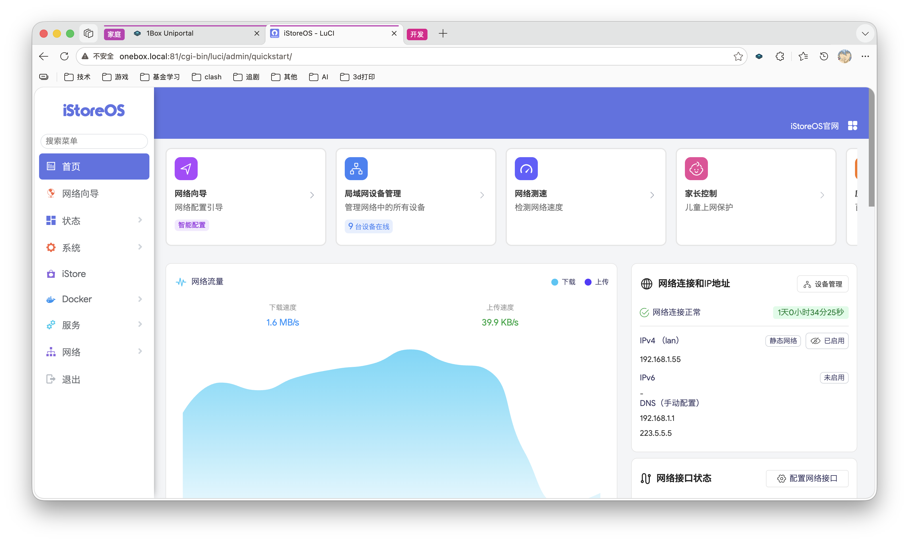

初始化 1Box 设备
==============

查看 1Box IP
-----------

1Box 支持 mDNS，可以免 IP 直接访问，但是有可能部分无法识别 mDNS 的场景，您可以在手机上访问 `http://onebox.local`，然后打开最下面的 "其他" -> "关于"，页面会直接显示本机 IP

若您使用的是 OpenWrt/ImmortalWrt 系统，也可以打开 "其他" -> "OpenWRT"，在 LuCI 界面右侧查看 IP；**其他系统没有 OpenWRT 入口，请使用上面的 "关于" 页面查看**

更新 1Box 服务
------------

系统安装好后，第一时间请检查 1Box 服务是否有新版本，如果有请先更新到最新版

有 ⏫ 图标就代表有新版本，点击图标可下载安装包，下载后点击版本号，选择下载好的文件，上传之后，1Box 将会自动更新版本

修改管理员密码
------------

1Box 和 OpenWRT 的默认密码都是 `password`，请第一时间重置密码([1Box 重置密码](http://onebox.local/#/admin/settings)、[OpenWRT 重置密码](http://onebox.local:81/))，两个系统密码必须保持一致！！！

> 说明：`OpenWRT 重置密码` 是 OpenWrt/ImmortalWrt 系统的 LuCI 界面，仅 OpenWrt 系系统可用；其他系统（如 Debian 等）没有该入口，请用 `passwd` 命令修改系统登录密码，1Box 密码则在 [1Box 系统设置](http://onebox.local/#/admin/settings) 中修改

1Box 在内网环境大多数服务都是不需要登录的，但是修改系统设置时，1Box 将会要求使用管理员密码登录后才可以操作

由于考虑到用户可能使用内网穿透把服务暴露到外网，1Box 要求外网环境需要先使用管理员密码登录。但这是建立在用户正确暴露服务的情况下，如果有内网穿透需求，请一定要把外网请求转发到 `127.0.0.1` 上，千万不要使用家庭局域网网段，否则 1Box 将无法区分出请求是否来自于外网

假设，1Box 在您家庭网络中的 IP 是 `192.168.1.100`，您使用内网穿透服务暴露到外网，并且配置的内网地址就是 `192.168.1.100`，那外网请求就可以免登录访问 1Box 服务。虽然内网穿透服务一般都会有安全校验措施，但是为了确保用户的安全，1Box 并不会完全把安全校验交给其他环节来实现。因此，为了数据安全，内网穿透功能一定要把外网请求转发到 `127.0.0.1` 上
